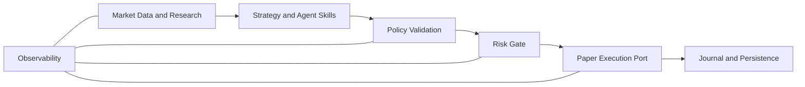

# CoinScopeAI

> Risk-first Agent OS for crypto-futures research, strategy workflows, simulation, and paper trading.

[](https://github.com/3nz5789/CoinScopeAI/actions/workflows/ci.yml) [](LICENSE)

## What it is

CoinScopeAI is a futures-native research and decision-support environment that is evolving into an AI-as-a-Service **Agent OS** for crypto traders. The repository combines market-data and research components with deterministic strategy contracts, graph inspection, explicit risk boundaries, and paper execution. The current Agent OS path is intentionally narrow: it turns a natural-language request into an editable paper-mode draft, validates the graph, inspects fixture or replay events, evaluates risk, and creates only a simulated paper fill when the request is approved. [1]

The current Phase-1 lifecycle is:

> **Prompt → Graph → Inspect → Risk gate → Paper fill → Journal/review** [1]

CoinScopeAI is **not** a generic signal bot, fund manager, copy-trading service, investment adviser, or default live-trading system. The current Agent OS API has no live-order placement or mainnet-wallet path, and non-paper execution modes are rejected at the Agent OS risk boundary. [2]

## Why it exists

Crypto futures decisions depend on more than an entry condition. Funding, open interest, liquidity, order-flow context, volatility, regime, exposure, and execution assumptions all affect how a strategy should be researched and reviewed. CoinScopeAI’s direction is to bring those concerns into a single workflow where strategy intent, data provenance, policy checks, risk decisions, simulated fills, and review metadata remain inspectable.

The platform is designed to make strategy work easier to describe and test without turning AI output into an ungoverned authority. The current prompt planner is deterministic and draft-oriented. A future model or provider may assist with structured workflow creation or explanation only after a separate design and implementation review; the current repository does not contain a model adapter or comprehensive runtime enforcement of that future boundary. [3]

## Current status

> **Current Agent OS focus:** deterministic paper-mode strategy workflows. The Phase-1 scaffold, graph validation, fixture inspection, paper-only risk gate, paper executor, API entry point, worker demo, and focused tests are present on `main`. The default local workflow is designed to run without exchange credentials on its paper path, although broader legacy engine and operations workflows may require their own configuration. [1] [4]
>
> **Not enabled by default:** live exchange order placement; testnet order submission from Agent OS entry points; mainnet wallets, custody, signing, or withdrawals; performance guarantees; profitability claims; and investment advice. The repository also contains older engine and P0/Testnet-oriented material, which must not be conflated with the current Agent OS paper contract. [1] [5]

Historical P0 validation documents remain useful as dated evidence about the legacy engine and its validation process. They are **historical/reported**, not a claim that the current Agent OS is production-ready or that any simulation, backtest, testnet run, or paper result predicts future performance. [5]

## Safety model

Safety is part of the Agent OS contract rather than a post-processing step.

| Boundary | Current behavior |
|---|---|
| Mode | The Agent OS accepts `paper` mode. Live and testnet order modes are rejected. |
| Strategy and runtime | The deterministic planner produces a draft; graph validation checks required fields; incomplete drafts are blocked before an execution request is created. |
| Data | The runner consumes provider-neutral fixture/replay data and emits observations with provenance rather than creating orders. |
| Policy and risk | `AgentRiskGate` validates identity, mode, connector, symbols, and order parameters, then delegates to the canonical paper-trading `SafetyGate`. Unknown or unsafe state is rejected rather than guessed. |
| Execution | `PaperExecutor` independently re-checks risk and records an in-memory simulated fill. Paper fills do not receive exchange order identifiers. |
| Audit and persistence | The repository has bounded journal and decision metadata contracts plus in-memory safety telemetry. Durable Agent OS authorization, audit, and relational persistence are separate future designs, not current guarantees. |
| AI boundary | ADR-0003 records constraints for a future explanation capability. It does not prove that an AI explanation adapter or comprehensive runtime enforcement exists today. |
| Secrets | Do not commit, log, fixture, serialize, or place in browser storage any API keys, private keys, wallet seed phrases, credentials, or sensitive account and journal data. |

The underlying repository also contains engine-side controls for leverage, sizing, exposure, drawdown, daily loss, circuit breakers, and kill-switch behavior. Read the current risk documentation and implementation before relying on a specific threshold; the Agent OS does not create a second threshold authority. [6]

This is software tooling for research, education, simulation, and workflow support. It is not financial advice.

## Core capabilities

### Current and bounded capabilities

- **Futures market context:** existing market-data services and contracts cover normalized event types such as candles, trades, order-book data, funding, liquidations, and open interest; provider-neutral on-chain and research-feed contracts remain deferred. [1]
- **Strategy specification:** deterministic natural-language prompt-to-draft planning with editable graph nodes, lifecycle state, and missing-field reporting.
- **Graph validation and inspection:** required schedule, market, condition, entry, risk, and exit nodes are validated before a draft can proceed; fixture or replay inspection emits observations and provenance.
- **Risk-gated paper execution:** paper requests cross the Agent OS risk boundary, receive a canonical safety decision, and are re-checked by the paper executor before a simulated fill is recorded.
- **Local API and worker workflow:** the Phase-1 FastAPI entry point and deterministic worker expose a paper-mode health check, draft workflow, risk status, risk evaluation, paper order, and paper session surfaces. [2] [4]
- **Focused verification:** deterministic fixtures, replay-compatible data ports, Agent OS tests, smoke checks, lint, typecheck, guardrails, and synchronization checks are available through the repository command surface. [4]

### Planned / evolving capabilities

The following are roadmap items or separately designed future capabilities, not promises of current availability: a full Agent Studio UI and persistent strategy projects; replay-backed simulation and backtesting with explicit fee, slippage, funding, leverage, and annualization assumptions; stronger data freshness and provenance controls; durable authorization and audit persistence; future model/provider explanation assistance; and separately approved connector or testnet workflows. Live trading remains disabled unless a future contract, implementation, validation process, and explicit human authorization are approved.

## Architecture



The `agent_os/` package is the canonical Phase-1 orchestration and control-plane boundary. It owns portable strategy contracts, graph validation, deterministic planning, fixture/replay inspection, the AgentRiskGate facade, the paper execution port, and the Agent OS API. Existing engine, market-data, paper-trading, dashboard, and research modules remain in the monorepo; this README does not describe them as deprecated or claim that they have been migrated. [1]

Strategies and Skills may propose intent or produce observations, but they do not bypass policy or risk evaluation. The paper execution port is the only execution path exposed by the current Agent OS contract. Any future connector must be separately designed and approved; reads, simulations, lifecycle changes, or backtests must never create live orders as a side effect.

## Quick start

The default Phase-1 workflow is local, deterministic, and paper-only. It is designed to operate without exchange credentials on its paper path. Broader legacy engine, notification, deployment, and operations workflows may require environment-specific configuration.

### Prerequisites

- Python 3.11 or newer.
- A POSIX-compatible shell for the commands below.
- Project dependencies installed through the repository Makefile.

### Install

```bash
git clone https://github.com/3nz5789/CoinScopeAI.git
cd CoinScopeAI

python3 -m venv .venv
source .venv/bin/activate
make install
```

Do not add live exchange credentials. If you are following a separate legacy engine or operations guide that requires configuration, copy a template only for that documented workflow:

```bash
cp .env.example .env
# or, for the daily-status utilities:
cp coinscope.env.example .env
```

Keep all credential fields empty unless a separately documented, human-approved non-live workflow requires them. The default Agent OS demo does not instruct you to configure an exchange account.

### Run the deterministic paper demo

```bash
make agent-demo
```

`make worker` is an alias for the same deterministic paper cycle. The output includes a paper-mode strategy document, fixture observations, a risk status, and a simulated paper-execution result. It does not place an exchange order. [4]

### Run the local Agent OS API

```bash
make dev-all
```

The API starts on `http://127.0.0.1:8010` with live order placement and mainnet wallets disabled. In another shell, with the virtual environment active:

```bash
curl http://127.0.0.1:8010/health

curl -X POST http://127.0.0.1:8010/agent/drafts \
  -H 'Content-Type: application/json' \
  -d '{"prompt":"Every 1h long BTCUSDT when funding is negative with risk 1% and stop loss 2%"}'
```

The draft route returns a strategy document, graph summary, validation result, and missing-field report. An incomplete request such as `Watch BTCUSDT` is blocked and does not create an execution request. [1] [2]

### Current Agent OS API surfaces

| Method | Route | Purpose |
|---|---|---|
| `GET` | `/health` | Health plus paper-mode and disabled-live indicators. |
| `POST` | `/agent/drafts` | Create a deterministic paper-mode strategy draft. |
| `GET` | `/agent/drafts/{name}` | Read an in-memory draft by name. |
| `POST` | `/risk/evaluate` | Evaluate a paper risk request. |
| `GET` | `/risk/status` | Read paper-mode risk status and non-secret safety telemetry. |
| `POST` | `/paper/orders` | Submit a request to the risk-gated paper executor. |
| `GET` | `/paper/session` | Read the in-memory paper-session summary. |

These are the current Agent OS routes. The broader legacy engine API is documented separately in [`docs/api/engine-api-contract.md`](docs/api/engine-api-contract.md) and must not be conflated with the Phase-1 Agent OS contract.

## Validation and tests

Run the focused Agent OS checks first:

```bash
python3 -m pytest -q tests/agent_os
```

The repository Makefile also provides these verified targets:

```bash
make smoke
make test
make lint
make typecheck
make guardrail
make sync
git diff --check
```

To replay existing recorded market-data files through the repository’s stream CLI:

```bash
make replay DATA_DIR=./data/recordings SPEED=10
```

The replay directory must already contain recorded JSONL or JSONL.GZ stream data. Do not treat a simulation or backtest result as profitability, investment advice, or a guarantee of future performance. Where replay or simulation is supported, record assumptions and provenance and prefer deterministic fixtures and repeatable runs. [1] [4]

## Repository Structure

The repository is a single monorepo. The table below describes present paths on `main`; planned migrations and naming changes belong in [`docs/architecture/repository-roadmap.md`](docs/architecture/repository-roadmap.md).

| Path | Purpose |
|---|---|
| `agent_os/` | Phase-1 contracts, data ports and fixtures, runtime graph/planner/runner, risk facade, paper execution, persistence metadata, and API. |
| `tests/agent_os/` | Focused graph, runtime, risk-boundary, paper-execution, persistence, authorization, capture-policy, and security-boundary tests. |
| `services/agent_worker/` | Deterministic Agent OS paper-cycle worker. |
| `services/market_data/` | Existing market-data stream, recording, and replay components. |
| `services/paper_trading/` | Existing canonical paper-trading safety implementation and related engine components. |
| `strategies/` | Strategy and research logic, configurations, and backtest-related scaffolding. |
| `engine/` | Existing engine and market-analysis components. |
| `risk_management/` | Existing risk-management and sizing components. |
| `apps/` | Application surfaces, including the React dashboard at `apps/dashboard/`. |
| `configs/` | Environment and operational configuration defaults. |
| `scripts/` | Verification, guardrail, health, validation, and synchronization scripts. |
| `docs/` | Architecture, risk, API, runbook, validation, monitoring, and roadmap documentation. |
| `deploy/` and `infra/` | Deployment resources, service definitions, container files, and infrastructure support. |
| `.env.example` | Broad repository/legacy engine environment template; never commit a real `.env`. |
| `coinscope.env.example` | Daily-status utility environment template; never commit real credentials. |

## Documentation

- [Agent OS Phase-1 architecture](docs/architecture/agent-os-phase1.md) — current workflow, boundaries, commands, and non-goals.
- [Repository roadmap](docs/architecture/repository-roadmap.md) — present-versus-planned structure and known documentation gaps.
- [ADR-0003: LLM off the hot path](docs/decisions/adr-0003-llm-off-hot-path.md) — approved future-capability constraints and evidence limits.
- [Risk framework](docs/risk/risk-framework.md) — legacy/current risk philosophy and safety controls.
- [Invariant matrix](docs/validation/invariant-matrix.md) — source, code, test, and evidence mapping with yellow-row limitations.
- [P0 evidence pack](docs/validation/p0-evidence-pack.md) — dated historical/reported validation evidence; read its honesty pass first.
- [Operator workflow](docs/runbooks/operator-workflow.md) — dated legacy/P0 operating procedure, not the default Agent OS quick start.
- [Engine API contract](docs/api/engine-api-contract.md) — broader engine API reference, separate from the Phase-1 Agent OS API.
- [Contributing](CONTRIBUTING.md) — branch, review, testing, and secret-handling expectations.
- [Development workflow](DEVELOPMENT_WORKFLOW.md) — broader process notes; reconcile with the more specific current `CONTRIBUTING.md` and repository Makefile.
- [Security policy](SECURITY.md) — private vulnerability-reporting and supported-version policy.
- [Deployment service notes](deploy/systemd/README.md) — separate deployment path requiring its own configuration and operational review.
- [License](LICENSE) — MIT license text.

## Roadmap

This roadmap is **planned and evolving**; it does not describe current availability or promise dates.

- Complete the Agent Studio surface over the existing strategy and graph contracts.
- Add replay-backed simulation and backtesting with explicit assumptions, provenance, and deterministic verification.
- Strengthen data freshness, event provenance, journal, and review visibility.
- Introduce durable authorization, audit, and persistence only through separately approved contracts and migrations.
- Consider future model/provider assistance and connector workflows only after their safety, authorization, testing, and human-approval gates are independently reviewed.

## Validation Phase Freeze

This heading is preserved for existing repository links. The active-looking P0 freeze language in older README versions is **historical/reported** and must not be read as a current readiness statement. The current Agent OS contract remains paper-only, and any future testnet or live workflow requires separate design, implementation, validation, and explicit human authorization.

## Disclaimer

CoinScopeAI is software for research, education, simulation, and workflow support. It does not provide investment advice. Digital-asset and leveraged-futures trading involve substantial risk, including the risk of losing the entire amount invested. Past simulations, historical tests, and paper-trading results do not guarantee future outcomes.

## Contributing

See [`CONTRIBUTING.md`](CONTRIBUTING.md) before opening a pull request. Keep documentation and implementation claims aligned with current repository evidence, and never commit `.env` files or secrets.

## Security

See [`SECURITY.md`](SECURITY.md) for the private vulnerability-reporting process and supported-version policy. Do not publish credentials, API keys, wallet material, sensitive account data, or private journal information in issues, pull requests, logs, fixtures, screenshots, or documentation.

## License

MIT — see [`LICENSE`](LICENSE).

## References

[1]: docs/architecture/agent-os-phase1.md
[2]: agent_os/api/app.py
[3]: docs/decisions/adr-0003-llm-off-hot-path.md
[4]: Makefile
[5]: docs/validation/p0-evidence-pack.md
[6]: docs/validation/invariant-matrix.md
