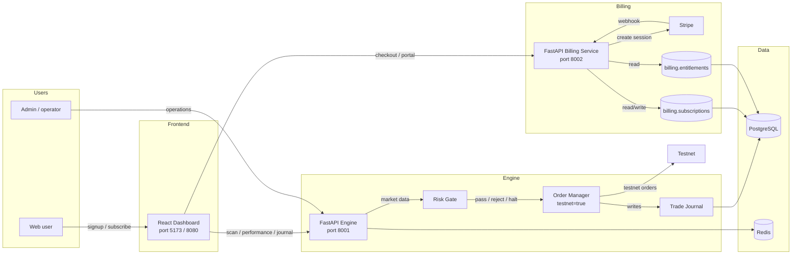

# CoinScopeAI Architecture v5

**Last updated:** 2026-07-27  
**Owner:** Mohammed (Founder)  
**Maintainer:** Scoopy (Strategy Chief of Staff)  
**Status:** Canonical — reflects the post-billing-refactor repository state  
**Supersedes:** Prior architecture notes through v4; companion doc [`system-overview.md`](system-overview.md) and [`component-map.md`](component-map.md)

---

## 1. Purpose

This document is the canonical architecture description for the CoinScopeAI Phase 1 SaaS MVP after the billing/entitlements refactor. It describes how the cleaned repository is organized, what each major component owns, and where the hard gates are. It is intentionally repository-aware: it names actual directories, ports, and pricing tiers rather than aspirational future state.

The architecture is still **capital-preservation first**. The engine remains paper-trading/testnet-only until the `§8 gate` is explicitly unlocked.

---

## 2. What's New in v5

v5 does not change the core trading-engine flow; it wraps the engine in the business architecture needed for a multi-tier SaaS product.

| Addition | What it is | Repository location |
|---|---|---|
| **Customer Layer** | Signup, ToS/Risk-Disclosure acceptance, email verification, subscription, entitlements | `coinscopeai-dashboard/` (UI) + `billing/` (state) |
| **Per-User State** | Per-user portfolios, risk profiles, exchange API key vault, journals, enabled strategies | `coinscope_trading_engine/` (engine API + Postgres) |
| **Cost Meter** | Per-user API consumption tracking and tier ceiling enforcement | `billing/pg_subscription_store.py`, `billing/entitlements.py` |
| **Trust rail** | Public Performance Dashboard + methodology + audit hooks | `coinscopeai-dashboard/` (future public pages) |
| **Compliance rail** | ToS/Risk Disclosures, KYC/AML pipeline, audit-log retention | `11-legal/`, `billing/`, dashboard onboarding |
| **ML Lifecycle band** | Model registry, shadow inference, A/B, retrain loop | `coinscope_trading_engine/intelligence/` (inference only for Phase 1) |
| **Root billing package** | Stripe Checkout, customer portal, webhook handler, entitlement sync | `billing/` |
| **`§8 gate`** | Named real-capital lock at the Order Manager | Hard-coded in engine execution layer |

The superseded hobbyist pricing has been removed. The canonical Track B tiers are now:

| Tier | Monthly | Annual | Repository source |
|---|---|---|---|
| Free | $0 | $0 | `billing/config.py`, `billing/entitlements.py`, `billing/migrations/001_initial_billing_tables.sql` |
| Trader | $79 | $758.40 (20% off) | same |
| Desk Preview | $399 | $3,830.40 (20% off) | same |
| Desk Full | $1,199 | $11,510.40 (20% off) | same |

---

## 3. Repository Layout

```text
CoinScopeAI/
├── billing/                          # Root billing package (NEW in v5)
│   ├── config.py                     # Canonical Track B pricing + Stripe Price IDs
│   ├── entitlements.py               # Static + DB-backed entitlement lookup
│   ├── models.py                     # Pydantic subscription/webhook schemas
│   ├── stripe_checkout.py            # Stripe Checkout session creation
│   ├── customer_portal.py            # Stripe Customer Portal creation
│   ├── webhook_handler.py            # Stripe webhook receiver + idempotency
│   ├── stripe_gateway.py             # Shared Stripe client helpers
│   ├── pg_subscription_store.py      # Postgres subscription + entitlement store
│   ├── subscription_store.py         # Abstract store interface
│   ├── notifications.py              # Billing notifications
│   └── migrations/
│       └── 001_initial_billing_tables.sql   # DB schema + entitlement seed
│
├── coinscope_trading_engine/         # FastAPI engine
│   ├── api/                          # FastAPI app (port 8001)
│   ├── execution/                    # Order lifecycle, fills, journaling
│   ├── intelligence/                 # HMM regime, v3 classifier
│   ├── risk/                         # Risk gate, kill switch, circuit breaker
│   ├── scanner/ + scanners/          # Universe iteration (consolidation queued)
│   ├── data/                         # In-memory market-data cache
│   ├── worker/                       # Celery background tasks
│   └── journal/                      # Append-only trade journal
│
├── coinscopeai-dashboard/            # React + Vite dashboard
│   ├── client/                       # React frontend (dev port 5173)
│   ├── server/                       # Express production server (port 8080)
│   └── package.json                  # Vite 7, React 19, Tailwind 4, wouter
│
├── coinscope-mcp-server/             # Optional MCP server (Node/TypeScript)
│   └── src/
│
├── docs/                             # Architecture, runbooks, criteria
│   ├── architecture/
│   │   ├── architecture-v5.md        # This file
│   │   ├── architecture.md           # Prior canonical view (also v5)
│   │   ├── component-map.md          # Module-by-module engine inventory
│   │   └── ...
│   └── Production_Candidate_Criteria.md   # v2.0 gate definitions
│
├── tests/                            # Billing + invariant tests
├── scripts/                          # Operational scripts
└── 11-legal/                         # ToS, Risk Disclosure, Privacy drafts
```

---

## 4. Component Reference

### 4.1 `coinscope_trading_engine/` — FastAPI Engine (port 8001)

- **Technology:** Python, FastAPI, Celery + Redis, SQLAlchemy/Postgres, SQLite fallback journal.
- **Responsibilities:**
  - Market-data ingestion from Binance Futures Testnet via CCXT.
  - Signal generation (scanner + confluence scorer).
  - Risk gate: regime alignment, heat, correlation, daily-loss budget, kill switch.
  - Position sizing (Kelly fraction with hard caps).
  - Order execution against testnet only; `testnet=true` is hard-coded in the Order Manager.
  - Append-only trade journal (`/journal`, `/performance`, `/risk-gate`, `/position-size`).
- **Key invariant:** ADR-004 — no LLM call on the signal/risk/order hot path.

### 4.2 `coinscopeai-dashboard/` — React + Vite Dashboard

- **Technology:** React 19, Vite 7, TypeScript, Tailwind CSS 4, Radix UI, TanStack Query, Recharts, Zustand, Wouter.
- **Ports:** `5173` dev (`pnpm dev`), `8080` production (`pnpm start`).
- **Responsibilities:**
  - Read-only dashboards for engine KPIs, journal, performance, regime status.
  - Subscription signup flow (Stripe Checkout redirect).
  - Customer Portal management.
  - Onboarding, ToS/Risk Disclosure click-through, email verification.
- **Data source:** Engine API (`localhost:8001`) and billing API (`localhost:8002`).

### 4.3 `billing/` — Root Billing Package (port 8002)

- **Technology:** Python, FastAPI, Pydantic, Stripe Python SDK, Postgres.
- **Responsibilities:**
  - `POST /billing/checkout` — create Stripe Checkout session for a tier.
  - `POST /billing/portal` — create Stripe Customer Portal session.
  - `POST /billing/webhook` — receive and idempotently process Stripe events.
  - `GET /billing/plans` — return canonical Track B catalogue.
  - Entitlement sync: Stripe subscription state → `billing.subscriptions` + `billing.entitlements`.
  - Per-user API usage tracking for Cost Meter enforcement.
- **Pricing source of truth:** `billing/config.py` defines `PLANS` for Free / Trader / Desk Preview / Desk Full.
- **Entitlement source of truth:** `billing/entitlements.py` static `TIER_ENTITLEMENTS` and `billing.entitlements` DB table seeded by `001_initial_billing_tables.sql`.

### 4.4 Data Stores

| Store | Use | Notes |
|---|---|---|
| PostgreSQL | Subscriptions, entitlements, invoice history, API usage, trade journal (when configured) | `billing/` schema owns billing tables; engine owns journal |
| Redis | Celery broker, caching, ephemeral state | |
| SQLite | Default engine journal when `DATABASE_URL` is not set | Migrations required for schema changes |
| Stripe | Subscription billing, invoices, webhook events | Test Mode for Phase 1 |

### 4.5 `coinscope-mcp-server/`

- Optional Model Context Protocol server for operator tooling.
- Not on the critical path for engine or dashboard runtime.

---

## 5. Data Flow



---

## 6. Gates

### 6.1 The `§8` Real-Capital Gate

The Order Manager's `testnet=true` flag flips to `false` only when **all** of the following are satisfied:

1. Readiness checklist §1–7 all green.
2. Dry-run paper trading complete (≥ N weeks), results logged (COI-41).
3. Per-provider health green for ≥ 7 consecutive days.
4. All 5 incident runbooks authored and rehearsed.
5. Small notional defined (recommended: ≤ 1% of intended live capital).
6. Post-launch cadence in place.

**Mechanism:** hard-coded `testnet=true` in the Order Manager until §8 sign-off. No env-var override. This is the same gate defined in Production Candidate Criteria v2 §8.

### 6.2 Tier Entitlement Gate

- Every request to a premium engine or dashboard endpoint must pass entitlement checks.
- DB-backed entitlements are authoritative; static `TIER_ENTITLEMENTS` is a fallback for tests.
- Free tier has no API access; Trader tier has no API access; Desk Preview and Desk Full have tiered rate limits (300 rpm and 1000 rpm respectively).

### 6.3 Compliance Gate

- Signed ToS and Risk Disclosure required before API auth (`CL1`, `CL2`).
- Email verification before first dashboard render (`CL3`).
- Jurisdictional blocklist at signup; US persons blocked until Phase B counsel sign-off (`CL6`).

---

## 7. Invariants

1. **All orders route to Binance Testnet during validation / G1.** Real capital is locked behind `§8`.
2. **ADR-004:** No LLM call on the signal, risk, or order path.
3. **Engine API is the authoritative read surface** for dashboard and operators.
4. **Risk Gate runs before sizing and the Order Manager.** Halt = full stop.
5. **Every signal, gate decision, and order is journaled** per `user_id`.
6. **Billing failure must never degrade core engine reads.** Entitlements enforce on premium endpoints only.
7. **Canonical pricing is Track B only:** Free, Trader ($79), Desk Preview ($399), Desk Full ($1,199).
8. **Stripe webhooks are idempotent** — every `evt_` is stored in `billing.webhook_events` before side effects.
9. **Vendor field names never leak past the Adapter layer.**
10. **LLM endpoint is `api.anthropic.com`** — never a third-party proxy.

---

## 8. Technology Summary

| Layer | Stack | Port |
|---|---|---|
| Engine API | Python, FastAPI, Celery | 8001 |
| Billing API | Python, FastAPI, Stripe SDK | 8002 |
| Dashboard | React 19, Vite 7, Express (prod) | 5173 dev / 8080 prod |
| MCP Server | Node.js / TypeScript | per config |
| Database | PostgreSQL 14+ | 5432 |
| Cache / Broker | Redis | 6379 |
| Observability | Prometheus, Grafana, Sentry (target) | |

---

## 9. Related Documents

- Production Candidate Criteria v2: `docs/Production_Candidate_Criteria.md`
- Component map: `docs/architecture/component-map.md`
- System overview: `docs/architecture/system-overview.md`
- Validation exit memo: `docs/validation_exit_memo_2026-05-09.md`
- Decision log: `business-plan/_decisions/decision-log.md`
- Track B pricing source of truth: `billing/config.py`
- Entitlement source of truth: `billing/entitlements.py`
- Billing schema seed: `billing/migrations/001_initial_billing_tables.sql`

---

## 10. Change Control

- Any change to pricing tiers requires updating `billing/config.py`, `billing/entitlements.py`, and `billing/migrations/001_initial_billing_tables.sql` together.
- Any change to the engine risk path requires two reviewers and a re-run of the validation criteria.
- Any change that weakens the `§8` gate requires External Risk Reviewer sign-off.
